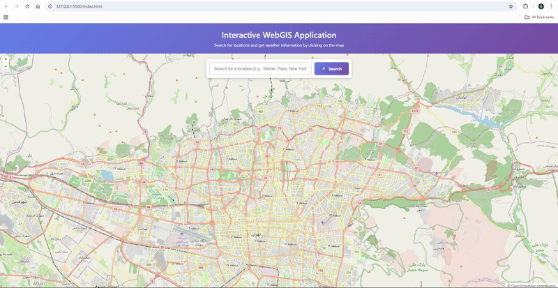
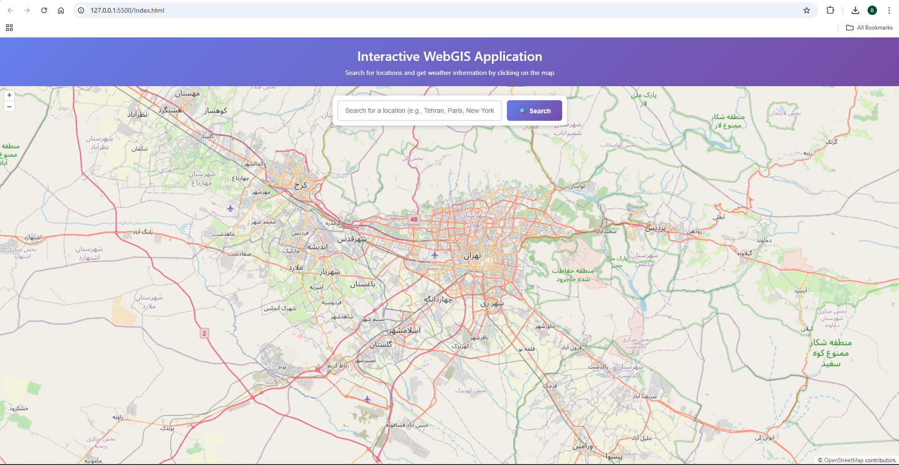
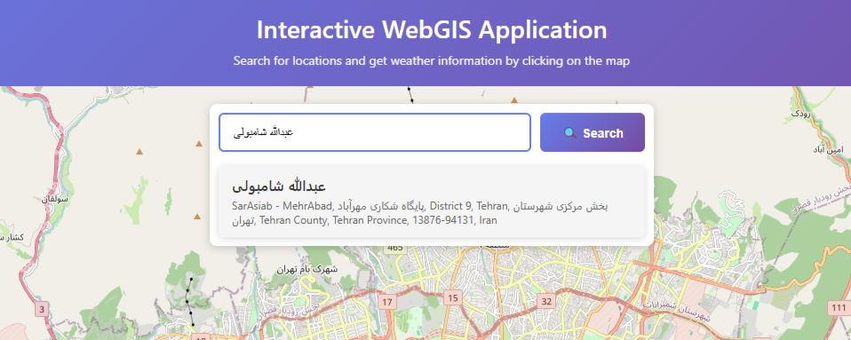
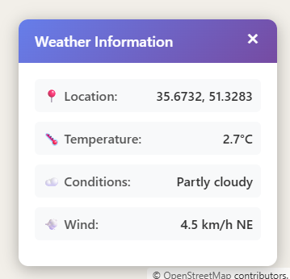

# WebGIS Assignment 2 - Interactive Map with Weather

An interactive web mapping application built with OpenLayers that provides geocoding search functionality with autocomplete and real-time weather information.

## 🌟 Features

- **Interactive Map**: Powered by OpenLayers with OpenStreetMap base tiles
- **Location Search with Autocomplete**: Search for any location worldwide with live suggestions
- **Weather Information**: Click anywhere on the map to get current weather data
- **Multiple Search Results**: Choose from multiple matching locations
- **Smooth Animations**: Animated map transitions and user-friendly interactions
- **Simple Setup**: No external configuration files needed

## 📋 Table of Contents

- [Demo](#demo)
- [Technologies Used](#technologies-used)
- [OpenLayers Features](#openlayers-features)
- [API Research & Comparison](#api-research--comparison)
  - [Geocoding APIs](#geocoding-apis)
  - [Weather APIs](#weather-apis)
- [Installation & Setup](#installation--setup)
- [Usage](#usage)
- [Project Structure](#project-structure)
- [API Configuration](#api-configuration)
- [Screenshots](#screenshots)

## 🚀 Demo

### How to Use:
1. **Search for a Location**: 
   - Start typing a city, address, or landmark in the search bar
   - Autocomplete suggestions appear after 3 characters (waits 300ms after you stop typing)
   - Click a suggestion or press Enter to search
2. **Click the Map**: Click anywhere on the map to get weather information for that location
3. **View Weather Data**: See temperature, wind speed, conditions, and more
4. **Close Panel**: Click the X button to close the weather panel

## 🛠️ Technologies Used

- **OpenLayers 10.3.1**: High-performance mapping library
- **HTML5**: Modern semantic markup
- **CSS3**: Custom styling with gradients and animations
- **Vanilla JavaScript**: No frameworks required - pure ES6+
- **Fetch API**: Modern asynchronous HTTP requests
- **Nominatim API**: Free geocoding service from OpenStreetMap
- **Open-Meteo API**: Free weather data service

## 🗺️ OpenLayers Features

This project demonstrates the following OpenLayers capabilities:

### 1. **Map Initialization**
- `ol.Map`: Core map component
- `ol.View`: Controls map viewport (center, zoom, projection)
- Projection transformation: Converting between EPSG:4326 (WGS84) and EPSG:3857 (Web Mercator)
- Initial center: Tehran, Iran (51.4093, 35.7447)
- Default zoom level: 12

### 2. **Layers**

#### Tile Layer (Base Map)
- `ol.layer.Tile`: Displays tiled map images
- `ol.source.OSM`: OpenStreetMap tile source
- Provides street-level map data worldwide

#### Vector Layer (Markers)
- `ol.layer.Vector`: Renders vector features
- `ol.source.Vector`: Manages vector feature collection
- `ol.Feature`: Represents geographic elements (search result markers)
- `ol.geom.Point`: Point geometry for markers

### 3. **Styling**
- `ol.style.Style`: Feature styling system
- `ol.style.Circle`: Circular point markers (8px radius)
- `ol.style.Fill`: Red fill color (#ff4444) for markers
- `ol.style.Stroke`: White border (2px) for marker visibility

### 4. **Interactions**
- **Map Click Events**: `singleclick` event to fetch weather data
- **Coordinate Transformation**: 
  - `ol.proj.fromLonLat()`: Convert API coordinates to map projection
  - `ol.proj.toLonLat()`: Convert map clicks to lat/lon for weather API
- **Dynamic Features**: Add/clear markers on each search

### 5. **View Controls & Animation**
- `view.animate()`: Smooth map transitions to search results
- Animation parameters:
  - Duration: 1000ms (1 second)
  - Target zoom: 14 (street level detail)
  - Easing: Default smooth easing

### 6. **Coordinate Systems**
- **EPSG:4326** (WGS84): Longitude/Latitude format used by APIs
- **EPSG:3857** (Web Mercator): Internal OpenLayers projection
- Automatic bidirectional coordinate transformations

## 📊 API Research & Comparison

### Geocoding APIs

I researched and compared the following geocoding APIs:

| API Provider | Free Tier | Rate Limit (Free) | Paid Pricing | API Key Required | Website |
|--------------|-----------|-------------------|--------------|------------------|---------|
| **Nominatim** (OpenStreetMap) | ✅ Unlimited | 1 request/second | Free only | ❌ No | [nominatim.org](https://nominatim.org/) |
| **Google Maps Geocoding** | $200 credit/month | 40,000 requests/month | $5 per 1,000 requests after | ✅ Yes | [developers.google.com/maps](https://developers.google.com/maps/documentation/geocoding) |
| **Mapbox Geocoding** | ✅ 100,000 requests/month | 100,000/month | $0.50 per 1,000 requests after | ✅ Yes | [mapbox.com/geocoding](https://www.mapbox.com/geocoding) |
| **LocationIQ** | ✅ 5,000 requests/day | 5,000/day (150k/month) | $49/month for 100k requests | ✅ Yes | [locationiq.com](https://locationiq.com/) |

#### Price Comparison & Ratios

Calculating for 100,000 requests per month:

- **Nominatim**: FREE (community service)
- **Google Maps**: ~$250 (after $200 credit: $5 × 50 = $250)
- **Mapbox**: FREE (within free tier)
- **LocationIQ**: FREE (within free tier)

**Price Ratios (for 500,000 requests/month):**
- Google Maps: $2,500 (baseline)
- Mapbox: $2,000 (0.8× Google Maps cost)
- LocationIQ: $294 (0.12× Google Maps cost - **8.3× cheaper!**)
- Nominatim: FREE (∞× cheaper, but rate-limited)

#### My Choice: **Nominatim**

**Reasoning:**
1. ✅ **Zero Cost**: Completely free with no registration or credit card
2. ✅ **No API Key**: Simplifies setup - works immediately
3. ✅ **Sufficient Rate Limit**: 1 req/sec is adequate for educational projects and small applications
4. ✅ **Privacy**: Open-source, no user tracking or data collection
5. ✅ **Reliability**: Backed by the robust OpenStreetMap community
6. ✅ **Global Coverage**: Worldwide location data from OSM
7. ✅ **Easy Integration**: Simple REST API with JSON responses

**Limitations**: 
- For production apps with high traffic (>86,400 requests/day), I would switch to LocationIQ or Mapbox
- Rate limit of 1 req/sec requires implementing request throttling for bulk operations

### Weather APIs

I researched and compared the following weather APIs:

| API Provider | Free Tier | Rate Limit (Free) | Paid Pricing | API Key Required | Website |
|--------------|-----------|-------------------|--------------|------------------|---------|
| **Open-Meteo** | ✅ Unlimited | 10,000 requests/day | Free only | ❌ No | [open-meteo.com](https://open-meteo.com/) |
| **OpenWeatherMap** | ✅ 1,000 requests/day | 60 calls/minute | $40/month for 100k calls | ✅ Yes | [openweathermap.org](https://openweathermap.org/api) |
| **WeatherAPI.com** | ✅ 1,000,000 calls/month | 1 million/month | $9.99/month for 2M calls | ✅ Yes | [weatherapi.com](https://www.weatherapi.com/) |
| **Visual Crossing** | ✅ 1,000 records/day | 1,000/day (30k/month) | $0.0001 per record | ✅ Yes | [visualcrossing.com](https://www.visualcrossing.com/weather-api) |

#### Price Comparison & Ratios

Calculating for 100,000 requests per month (~3,300/day):

- **Open-Meteo**: FREE
- **OpenWeatherMap**: ~$120 ($40/month for 100k calls)
- **WeatherAPI.com**: FREE (within free tier)
- **Visual Crossing**: $10 (0.0001 × 100,000)

**Price Ratios (for 3,000,000 requests/month):**
- OpenWeatherMap: $1,200 (baseline: $40 × 30 = $1,200)
- WeatherAPI.com: $29.97 (0.025× OpenWeatherMap - **40× cheaper!**)
- Visual Crossing: $300 (0.25× OpenWeatherMap - **4× cheaper**)
- Open-Meteo: FREE (**∞× cheaper!**)

#### My Choice: **Open-Meteo**

**Reasoning:**
1. ✅ **Zero Cost**: Completely free with no API key required
2. ✅ **Generous Limits**: 10,000 requests/day is excellent for any educational or small commercial project
3. ✅ **No Registration**: No account creation barriers - works immediately
4. ✅ **High Data Quality**: Aggregates data from multiple meteorological sources (NOAA, DWD, etc.)
5. ✅ **Rich Features**: Current weather, forecasts, historical data all available
6. ✅ **Open Source**: Transparent methodology and community-driven
7. ✅ **Perfect for Learning**: Zero barriers to entry
8. ✅ **WMO Standards**: Uses standard weather codes for reliable interpretation

**Alternative**: For production applications requiring advanced features (weather alerts, air quality indices, marine data), I would consider **WeatherAPI.com** for its excellent free tier (1M requests/month) and very low paid pricing.

## 💾 Installation & Setup

### Prerequisites
- A modern web browser (Chrome, Firefox, Edge, Safari)
- No build tools required!
- No API keys needed!

Calculating for 100,000 requests per month:

- **Nominatim**: FREE (community service)
- **Google Maps**: ~$250 (after $200 credit: $5 × 50 = $250)
- **Mapbox**: FREE (within free tier)
- **LocationIQ**: FREE (within free tier)

**Price Ratios (for 500,000 requests/month):**
- Google Maps: $2,500 (baseline)
- Mapbox: $2,000 (0.8× Google Maps cost)
- LocationIQ: $294 (0.12× Google Maps cost - 8.3× cheaper!)
- Nominatim: FREE (∞× cheaper, but limited by rate)

#### My Choice: **Nominatim**

**Reasoning:**
1. **Cost**: Completely free with no registration
2. **No API Key**: Simplifies setup and deployment
3. **Sufficient Rate Limit**: 1 req/sec is adequate for educational projects
4. **Privacy**: Open-source, no user tracking
5. **Reliability**: Backed by OpenStreetMap community
6. **Limitations**: For production apps with high traffic, I would switch to LocationIQ or Mapbox

### Weather APIs

I researched and compared the following weather APIs:

| API Provider | Free Tier | Rate Limit (Free) | Paid Pricing | API Key Required | Website |
|--------------|-----------|-------------------|--------------|------------------|---------|
| **Open-Meteo** | ✅ Unlimited | 10,000 requests/day | Free only | ❌ No | [open-meteo.com](https://open-meteo.com/) |
| **OpenWeatherMap** | ✅ 1,000 requests/day | 60 calls/minute | $40/month for 100k calls | ✅ Yes | [openweathermap.org](https://openweathermap.org/api) |
| **WeatherAPI.com** | ✅ 1,000,000 calls/month | 1 million/month | $9.99/month for 2M calls | ✅ Yes | [weatherapi.com](https://www.weatherapi.com/) |
| **Visual Crossing** | ✅ 1,000 records/day | 1,000/day (30k/month) | $0.0001 per record | ✅ Yes | [visualcrossing.com](https://www.visualcrossing.com/weather-api) |

#### Price Comparison & Ratios

Calculating for 100,000 requests per month (~3,300/day):

- **Open-Meteo**: FREE
- **OpenWeatherMap**: ~$120 ($40/month for 100k calls)
- **WeatherAPI.com**: FREE (within free tier)
- **Visual Crossing**: $10 (0.0001 × 100,000)

**Price Ratios (for 3,000,000 requests/month):**
- OpenWeatherMap: $1,200 (baseline: $40 × 30 = $1,200)
- WeatherAPI.com: $29.97 (0.025× OpenWeatherMap - 40× cheaper!)
- Visual Crossing: $300 (0.25× OpenWeatherMap - 4× cheaper)
- Open-Meteo: FREE (∞× cheaper!)

#### My Choice: **Open-Meteo**

**Reasoning:**
1. **Cost**: Completely free with no API key required
2. **Generous Limits**: 10,000 requests/day is excellent for any project
3. **No Registration**: Simplifies setup - no account needed
4. **Data Quality**: High-quality weather data from multiple sources
5. **Features**: Provides current weather, forecasts, and historical data
6. **Open Source**: Transparent and community-driven
7. **Perfect for Learning**: No barriers to getting started

**Alternative**: For production applications requiring more advanced features (alerts, air quality, etc.), I would consider **WeatherAPI.com** for its excellent free tier and low paid pricing.

## 💾 Installation & Setup

### Prerequisites
- A modern web browser (Chrome, Firefox, Edge, Safari)
- No build tools required!
- No API keys needed!

### Quick Start (3 Easy Steps)

1. **Download the project**
   ```bash
   git clone <your-repo-url>
   cd KNTU_WebGIS_Course_4041_A2
   ```

2. **Open the application**
   - **Option A**: Simply double-click `index.html` to open in your browser
   - **Option B**: Use a local server for better performance:
     ```bash
     # Python 3
     python -m http.server 8000
     
     # Or Python 2
     python -m SimpleHTTPServer 8000
     
     # Or Node.js
     npx http-server
     ```

3. **Start using**
   - If using a server, navigate to `http://localhost:8000`
   - The app works immediately - no configuration needed!

### API Configuration (Built-in)

The application comes pre-configured with free APIs that require no registration:

```javascript
// Built into script.js - no changes needed!
const GEOCODING_API_KEY = '';  // Nominatim doesn't need a key
const GEOCODING_API_URL = 'https://nominatim.openstreetmap.org/search';
const WEATHER_API_KEY = '';  // Open-Meteo doesn't need a key
const WEATHER_API_URL = 'https://api.open-meteo.com/v1/forecast';
```

**Why no API keys?**
- Both Nominatim and Open-Meteo are completely free services
- No registration or authentication required
- Perfect for educational projects and getting started quickly

### Optional: Using Alternative APIs

If you want to use different geocoding services (Google Maps, Mapbox, etc.), you can edit the API configuration at the top of `script.js`:

**Example: Using a service that requires an API key:**
```javascript
// Edit these lines in script.js
const GEOCODING_API_KEY = 'your_api_key_here';
const GEOCODING_API_URL = 'https://api.example.com/geocode';
```

Then modify the fetch logic to match your chosen API's request/response format.

## 📖 Usage

### Search for a Location with Autocomplete

1. Click on the search bar and start typing (e.g., "Tehran", "Paris", "New York")
2. After typing 3 or more characters, wait 300ms and autocomplete suggestions will appear
3. You'll see up to 5 matching locations with:
   - **Title**: Main location name
   - **Address**: Full address details
4. Click on any suggestion to select it, or press Enter to search with your current input
5. The map will smoothly animate to the location and place a red marker
6. Click outside the suggestions to hide them

### Get Weather Information

1. Click anywhere on the map (on land or sea!)
2. A weather panel will appear in the bottom-right corner showing:
   - 📍 **Location**: Coordinates (latitude, longitude)
   - 🌡️ **Temperature**: Current temperature in Celsius
   - ☁️ **Conditions**: Weather description (Clear, Cloudy, Rain, etc.)
   - 💨 **Wind**: Wind speed in km/h and direction (N, NE, E, etc.)
3. Weather data is fetched in real-time from Open-Meteo

### Close Weather Panel

- Click the ❌ button in the top-right corner of the weather panel

## 📁 Project Structure

```
KNTU_WebGIS_Course_4041_A2/
│
├── index.html          # Main HTML structure
├── style.css           # All styling (header, search, map, weather panel)
├── script.js           # Complete application logic with API configuration
├── README.md           # This comprehensive documentation
└── INSTRUCTIONS.md     # Original assignment instructions
```

**Simplified Structure:**
- No `config.js` - API settings are directly in `script.js`
- No `.gitignore` - using free public APIs with no sensitive keys
- No build process - pure vanilla JavaScript
- Only 3 main files to work with!

## 🔧 API Configuration Details

### Current Configuration

**Geocoding: Nominatim (OpenStreetMap)**
```javascript
const GEOCODING_API_URL = 'https://nominatim.openstreetmap.org/search';
const GEOCODING_API_KEY = '';  // Not needed

// Request format:
// GET https://nominatim.openstreetmap.org/search?format=json&q=Tehran&limit=5

// Response format:
[
  {
    "display_name": "Tehran, Iran",
    "lat": "35.6892",
    "lon": "51.3890"
  }
]
```

**Weather: Open-Meteo**
```javascript
const WEATHER_API_URL = 'https://api.open-meteo.com/v1/forecast';
const WEATHER_API_KEY = '';  // Not needed

// Request format:
// GET https://api.open-meteo.com/v1/forecast?latitude=35.7&longitude=51.4&current_weather=true

// Response format:
{
  "current_weather": {
    "temperature": 18.5,
    "windspeed": 12.3,
    "winddirection": 180,
    "weathercode": 0
  }
}
```

### Code Architecture

The application uses a dual API detection system:

```javascript
// Detects which API is being used based on URL
const requiresApiKey = GEOCODING_API_URL.includes('neshan');

if (requiresApiKey) {
    // API that needs authentication (like Neshan, Google Maps)
    options.headers = { 'Api-Key': GEOCODING_API_KEY };
    // Parse response: data.items
} else {
    // Public API (like Nominatim)
    // No headers needed
    // Parse response: data (array)
}
```

This design makes it easy to switch between different geocoding services without rewriting the entire fetch logic.

## 🎯 Key Features Explained

### 1. Autocomplete Search
- **Debouncing**: Waits 300ms after user stops typing to avoid excessive API calls
- **Minimum Characters**: Requires 3+ characters to trigger autocomplete
- **Live Results**: Shows up to 5 matching locations in real-time
- **Click-outside Dismissal**: Results dropdown closes when clicking elsewhere
- **Keyboard Support**: Press Enter to search without selecting from dropdown

### 2. Multiple Results Handling
- When multiple locations match, displays all options for user selection
- Each result shows title and full address for clarity
- Single-click selection updates map and closes dropdown
- Prevents auto-selection during autocomplete (only on explicit search)

### 3. Weather Data Interpretation
- Uses WMO (World Meteorological Organization) weather codes
- Converts numeric codes to readable descriptions
- Wind direction converted from degrees to compass directions (N, NE, E, etc.)
- Temperature displayed in Celsius

### 4. Map Animations
- Smooth 1-second animation when zooming to search results
- Markers automatically cleared and replaced on new search
- View animates to zoom level 14 for optimal street-level detail

## 📸 Screenshots

### Demo

*Complete application demonstration*

### Main Interface

*Interactive map with search bar and OpenStreetMap tiles*

### Autocomplete Suggestions

*Live suggestions appear as you type location names*

### Search Results

*Multiple matching locations displayed for selection*

### Weather Panel

*Current weather information displayed on map click*

### Marker Placement

*Red circular marker shows selected location*

## 🎓 Learning Outcomes

Through this project, I learned:

1. **OpenLayers Fundamentals**
   - Map initialization and configuration
   - Layer management (tile and vector layers)
   - Feature styling and rendering
   - Coordinate transformations between projections

2. **Asynchronous JavaScript**
   - Using the Fetch API for HTTP requests to geocoding and weather services
   - Async/await syntax for cleaner, more readable asynchronous code
   - Error handling with try-catch blocks
   - Promise-based programming patterns
   - Debouncing user input to optimize API calls

3. **API Integration & Research**
   - Comparing multiple API providers (4 geocoding + 4 weather APIs)
   - Understanding rate limits, pricing models, and free tier limitations
   - Making authenticated vs. public API calls
   - Parsing different JSON response formats
   - Implementing dual API support with automatic detection
   - Cost-benefit analysis for API selection

4. **User Experience Design**
   - Autocomplete with debouncing (300ms delay)
   - Multiple search results with clear selection UI
   - Loading states and user feedback
   - Error handling with user-friendly messages
   - Smooth animations and transitions
   - Click-outside-to-close behavior

5. **Web Development Best Practices**
   - Clean, maintainable code structure
   - Separation of concerns (HTML/CSS/JS)
   - Meaningful variable and function names
   - Comment strategy for beginner-level code
   - No external dependencies (pure vanilla JavaScript)
   - Browser compatibility considerations

6. **Problem Solving**
   - Researching and comparing 8 different APIs
   - Calculating price ratios for cost comparison
   - Implementing fallback strategies
   - Handling edge cases (no results, API errors, network failures)

## 🚀 Advanced Features

### Autocomplete Implementation
```javascript
// Debouncing to avoid excessive API calls
searchInput.addEventListener('input', function(e) {
    clearTimeout(autocompleteTimeout);
    if (query.length < 3) return;
    
    autocompleteTimeout = setTimeout(() => {
        fetchAutocomplete(query);
    }, 300);
});
```

### Dual API Support
```javascript
// Automatic API detection
const requiresApiKey = GEOCODING_API_URL.includes('neshan');

// Different handling for different APIs
const results = requiresApiKey ? data.items : data;
```

### Weather Code Interpretation
```javascript
// WMO weather codes converted to readable descriptions
function getWeatherDesc(code) {
    const codes = {
        0: 'Clear', 1: 'Mainly clear', 2: 'Partly cloudy',
        45: 'Foggy', 61: 'Rain', 95: 'Thunderstorm'
    };
    return codes[code] || 'Unknown';
}
```

## 🐛 Known Limitations

1. **Rate Limiting**: Nominatim has a 1 req/sec limit - not suitable for high-traffic applications
2. **No Caching**: Each search makes a new API request (could be optimized with caching)
3. **English Only UI**: Interface text is in English (could be internationalized)
4. **Desktop Optimized**: Mobile responsiveness was removed per requirements
5. **Basic Error Messages**: Could provide more detailed error information

## 🔮 Future Enhancements

- Add result caching to reduce API calls
- Implement geolocation to find user's current location
- Add route planning between two points
- Display weather forecast (not just current weather)
- Add more weather data (humidity, pressure, UV index)
- Implement custom map styles/themes
- Add multiple marker support
- Save favorite locations
- Export location data

## 📚 Resources & Documentation

### OpenLayers
- [Official Documentation](https://openlayers.org/en/latest/apidoc/)
- [Examples](https://openlayers.org/en/latest/examples/)
- [Tutorials](https://openlayers.org/doc/tutorials/)

### APIs Used
- [Nominatim API Docs](https://nominatim.org/release-docs/latest/api/Overview/)
- [Open-Meteo API Docs](https://open-meteo.com/en/docs)
- [WMO Weather Codes](https://open-meteo.com/en/docs#weathervariables)

### Alternative APIs Researched
- [Google Maps Geocoding API](https://developers.google.com/maps/documentation/geocoding)
- [Mapbox Geocoding API](https://docs.mapbox.com/api/search/geocoding/)
- [LocationIQ API](https://locationiq.com/docs)
- [OpenWeatherMap API](https://openweathermap.org/api)
- [WeatherAPI.com](https://www.weatherapi.com/docs/)
- [Visual Crossing Weather](https://www.visualcrossing.com/weather-api)

## 👨‍💻 Author

Created as part of KNTU WebGIS Course Assignment 2 - Term 1, 2024/2025

## 📄 License

This project is created for educational purposes as part of a university assignment.

## 🙏 Acknowledgments

- [OpenLayers](https://openlayers.org/) - Powerful open-source mapping library
- [OpenStreetMap](https://www.openstreetmap.org/) - Community-driven map data
- [Nominatim](https://nominatim.org/) - Free geocoding service by OSM
- [Open-Meteo](https://open-meteo.com/) - Free weather API with excellent data quality
- KNTU WebGIS Course instructors and teaching assistants
- The open-source community for making free tools accessible to students

---

**⭐ If you found this project helpful, please consider giving it a star!**
